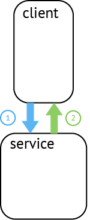
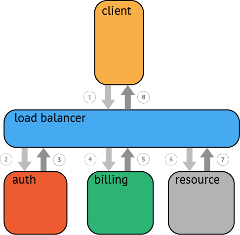
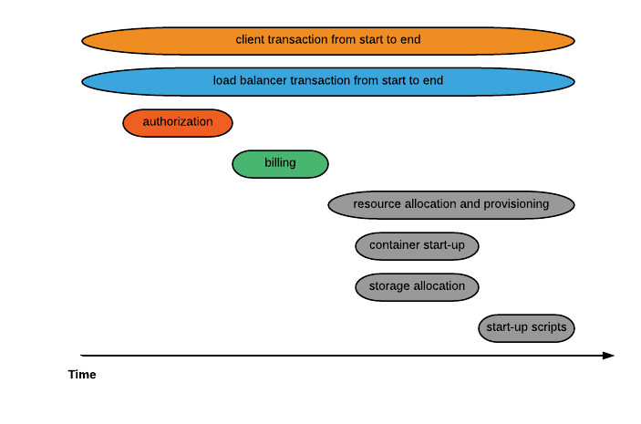

# Tracing Overview

## Why Tracing?

Developers and engineering organizations are trading in old, monolithic systems for modern microservice architectures, and they do so for numerous compelling reasons: system components scale independently, dev teams stay small and agile, deployments are continuous and decoupled, and so on.

That said, once a production system contends with real concurrency or splits into many services, crucial (and formerly easy) tasks become difficult: user-facing latency optimization, root-cause analysis of backend errors, communication about distinct pieces of a now-distributed system, etc.

Contemporary distributed tracing systems (e.g., Zipkin, Dapper, HTrace, X-Trace, among others) aim to address these issues, but they do so via application-level instrumentation using incompatible APIs. Developers are uneasy about tightly coupling their polyglot systems to any particular distributed tracing implementation, yet the application-level instrumentation APIs for these many distinct tracing systems have remarkably similar semantics.

## Why OpenTracing?
Enter OpenTracing: by offering consistent, expressive, vendor-neutral APIs for popular platforms, OpenTracing makes it easy for developers to add (or switch) tracing implementations with an O(1) configuration change. OpenTracing also offers a lingua franca for OSS instrumentation and platform-specific tracing helper libraries. Please refer to the Semantic Specification.

## What is a Trace?

At the highest level, a trace tells the story of a transaction or workflow as it propagates through a (potentially distributed) system. In OpenTracing, a trace is a directed acyclic graph (DAG) of "spans": named, timed operations representing a contiguous segment of work in that trace.

Each component in a distributed trace will contribute its own span or spans. In the case of a trivial RPC, for instance, OpenTracing expects both the client and server to represent their respective role in the workflow as at least one span.

A parent span may explicitly start other spans, either in serial or in parallel. In OpenTracing, it is even possible to model a child span with multiple parents (e.g., a buffer flush may descend from the multiple writes that filled said buffer).

### A Basic Trace

Tracing a workflow or transaction through a distributed system often looks something like the above. While this type of visualization can be useful to see how various components fit together, it does not convey any time durations, does not scale well, and is cumbersome when parallelism is involved. Another limitation is that there is no way to easily show latency or other aspects of timing. A more useful way to visualize even a basic trace often looks like this:

This type of visualization adds the context of time, the hierarchy of the services involved, and the serial or parallel nature of the process/task execution. This view helps to highlight the system's critical path. By focusing on the critical path, attention can focus on the area of code where the most valuable improvements can be made. For example, you might want to trace the resource allocation spans inside an API request down to the underlying blocking calls.
